hw02-solution.Rmd
================

### Loading gapminder dataset and tidyverse.

``` r
library(gapminder)
suppressPackageStartupMessages(library(tidyverse))
library(knitr)
```

### Exploring the dataset!

The gapminder dataset is a data frame. In oher words, this is tabular data! We can print out the object itself to understand this as:

``` r
df <- gapminder
ncol(df)
```

    ## [1] 6

It seems the data frame has 6 columns and there are 1704 rows in the dataset:

``` r
nrow(df)
```

    ## [1] 1704

A quick summary can be obtained with the summary function. This helps when you want to understand the data in terms of the common statistical insights it can provide, like mean, median, quantiles, min or max.

``` r
summary(df)
```

    ##         country        continent        year         lifeExp     
    ##  Afghanistan:  12   Africa  :624   Min.   :1952   Min.   :23.60  
    ##  Albania    :  12   Americas:300   1st Qu.:1966   1st Qu.:48.20  
    ##  Algeria    :  12   Asia    :396   Median :1980   Median :60.71  
    ##  Angola     :  12   Europe  :360   Mean   :1980   Mean   :59.47  
    ##  Argentina  :  12   Oceania : 24   3rd Qu.:1993   3rd Qu.:70.85  
    ##  Australia  :  12                  Max.   :2007   Max.   :82.60  
    ##  (Other)    :1632                                                
    ##       pop              gdpPercap       
    ##  Min.   :6.001e+04   Min.   :   241.2  
    ##  1st Qu.:2.794e+06   1st Qu.:  1202.1  
    ##  Median :7.024e+06   Median :  3531.8  
    ##  Mean   :2.960e+07   Mean   :  7215.3  
    ##  3rd Qu.:1.959e+07   3rd Qu.:  9325.5  
    ##  Max.   :1.319e+09   Max.   :113523.1  
    ## 

Classes - or data types of each of the variables:

``` r
class(df$country) # factor
```

    ## [1] "factor"

``` r
# Or we could apply the function class directly!
sapply(df, class)
```

    ##   country continent      year   lifeExp       pop gdpPercap 
    ##  "factor"  "factor" "integer" "numeric" "integer" "numeric"

Size of dataset, or an idea about the contents an be obtained in many different ways.

``` r
str(df)
```

    ## Classes 'tbl_df', 'tbl' and 'data.frame':    1704 obs. of  6 variables:
    ##  $ country  : Factor w/ 142 levels "Afghanistan",..: 1 1 1 1 1 1 1 1 1 1 ...
    ##  $ continent: Factor w/ 5 levels "Africa","Americas",..: 3 3 3 3 3 3 3 3 3 3 ...
    ##  $ year     : int  1952 1957 1962 1967 1972 1977 1982 1987 1992 1997 ...
    ##  $ lifeExp  : num  28.8 30.3 32 34 36.1 ...
    ##  $ pop      : int  8425333 9240934 10267083 11537966 13079460 14880372 12881816 13867957 16317921 22227415 ...
    ##  $ gdpPercap: num  779 821 853 836 740 ...

For example, the str function can be used when we want to learn the name of the columns of data in the tibble, and the data types quickly and in a well-formatted, compact way, as well as some of the values per column.

### Exploring individual variables

What are possible values (or range, whichever is appropriate) of each variable? For the quantitative variable of population, range is as below:

``` r
population <- df$pop
min(population) 
```

    ## [1] 60011

``` r
max(population) 
```

    ## [1] 1318683096

``` r
summary(population)
```

    ##      Min.   1st Qu.    Median      Mean   3rd Qu.      Max. 
    ## 6.001e+04 2.794e+06 7.024e+06 2.960e+07 1.959e+07 1.319e+09

Let's look at a histogram for this:

``` r
hist(population, breaks=12, col="blue")
```

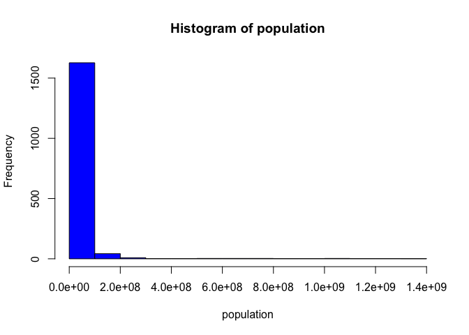 It seems like an exponential distribution.

It also seems there is more instances of the population being generally lower than the greatest value, as can be seen by summary statistics and histogram plot. A nicer looks for this:

``` r
ggplot(gapminder, aes(population)) + geom_histogram(aes(fill=continent), bins=25)
```

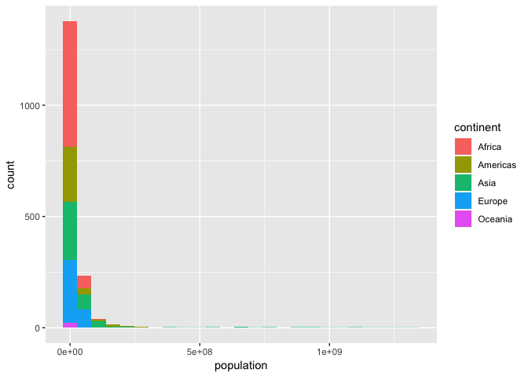

For the continent categorical variable:

``` r
continents <- df$continent
summary(continents)
```

    ##   Africa Americas     Asia   Europe  Oceania 
    ##      624      300      396      360       24

``` r
ggplot(df, aes(x=population, y=continents, color=population)) + geom_point()
```

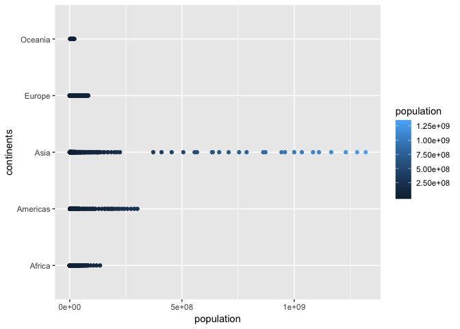

From this we understand most of the countries with a high population over all years included in the dataframe(we don't care about that for now), is Asia. And Oceania is mostly very little habitated.

### Explore various plot types

A scatterplot of two quantitative variables.

``` r
ggplot(gapminder, aes(x=population, y=lifeExp, color=continent)) +
  geom_point() +
  scale_y_log10()
```

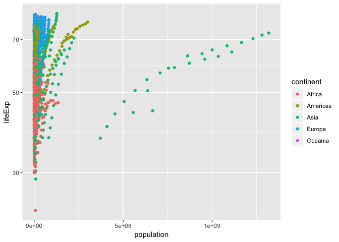

A densityplot of one quantitative variable.

``` r
plot(density(population))
```

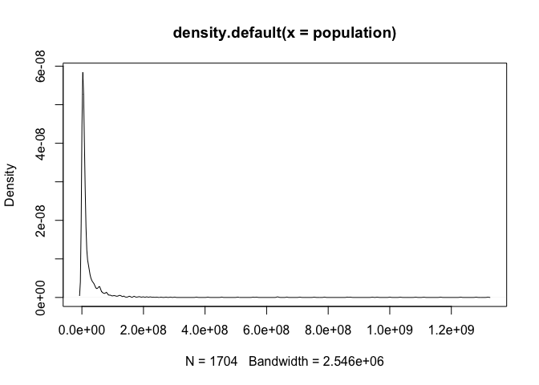

``` r
plot(density(df$gdpPercap))
```

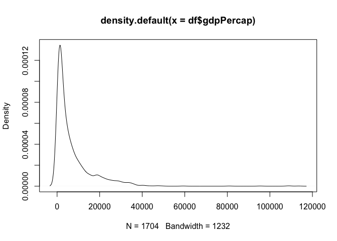

A plot of one quantitative variable and one categorical follow.

``` r
continent_pop <- ggplot(gapminder, aes(continent, gdpPercap)) + scale_y_log10()
continent_pop + geom_boxplot()
```

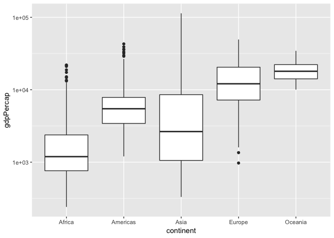

I am also including for the country of China:

``` r
china <- ggplot(filter(gapminder, country == "China"), aes(country, gdpPercap)) + scale_y_log10()
china + geom_boxplot()
```

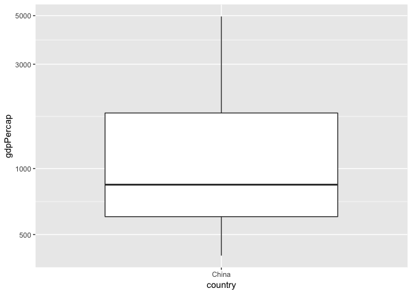

### Use filter(), select() and %&gt;%

A different view on the gdpPercap-lifeExp scatterplot over time, for a filtered period

``` r
gapminder %>%
  filter(population > 100000 & population < 1000000) %>%
  select(-continent) %>%
  ggplot(aes(gdpPercap, lifeExp, color=year)) + geom_point()
```

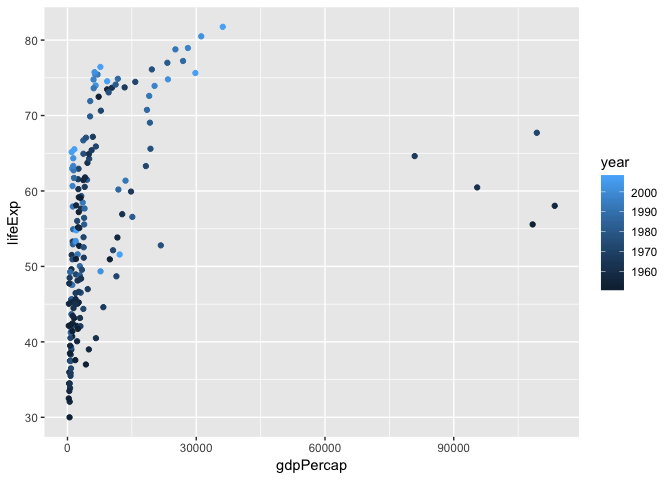

And yet over different continents:

``` r
gapminder %>%
  filter(population > 100000 & population < 1000000) %>%
  ggplot(aes(gdpPercap, lifeExp, color=continent)) + geom_point()
```

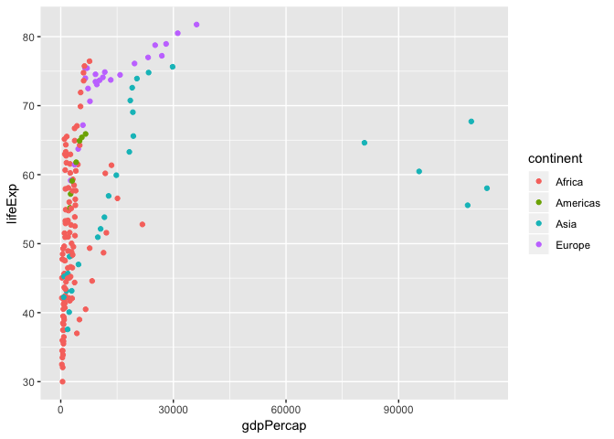

### But I want to do more!

This is not correct!

``` r
filter(gapminder, country == "Rwanda") # 12 rows
```

    ## # A tibble: 12 x 6
    ##    country continent  year lifeExp     pop gdpPercap
    ##    <fct>   <fct>     <int>   <dbl>   <int>     <dbl>
    ##  1 Rwanda  Africa     1952    40   2534927      493.
    ##  2 Rwanda  Africa     1957    41.5 2822082      540.
    ##  3 Rwanda  Africa     1962    43   3051242      597.
    ##  4 Rwanda  Africa     1967    44.1 3451079      511.
    ##  5 Rwanda  Africa     1972    44.6 3992121      591.
    ##  6 Rwanda  Africa     1977    45   4657072      670.
    ##  7 Rwanda  Africa     1982    46.2 5507565      882.
    ##  8 Rwanda  Africa     1987    44.0 6349365      848.
    ##  9 Rwanda  Africa     1992    23.6 7290203      737.
    ## 10 Rwanda  Africa     1997    36.1 7212583      590.
    ## 11 Rwanda  Africa     2002    43.4 7852401      786.
    ## 12 Rwanda  Africa     2007    46.2 8860588      863.

``` r
filter(gapminder, country == "Afghanistan") # 12 rows
```

    ## # A tibble: 12 x 6
    ##    country     continent  year lifeExp      pop gdpPercap
    ##    <fct>       <fct>     <int>   <dbl>    <int>     <dbl>
    ##  1 Afghanistan Asia       1952    28.8  8425333      779.
    ##  2 Afghanistan Asia       1957    30.3  9240934      821.
    ##  3 Afghanistan Asia       1962    32.0 10267083      853.
    ##  4 Afghanistan Asia       1967    34.0 11537966      836.
    ##  5 Afghanistan Asia       1972    36.1 13079460      740.
    ##  6 Afghanistan Asia       1977    38.4 14880372      786.
    ##  7 Afghanistan Asia       1982    39.9 12881816      978.
    ##  8 Afghanistan Asia       1987    40.8 13867957      852.
    ##  9 Afghanistan Asia       1992    41.7 16317921      649.
    ## 10 Afghanistan Asia       1997    41.8 22227415      635.
    ## 11 Afghanistan Asia       2002    42.1 25268405      727.
    ## 12 Afghanistan Asia       2007    43.8 31889923      975.

``` r
filter(gapminder, country == c("Rwanda", "Afghanistan")) # 12 rows :(
```

    ## # A tibble: 12 x 6
    ##    country     continent  year lifeExp      pop gdpPercap
    ##    <fct>       <fct>     <int>   <dbl>    <int>     <dbl>
    ##  1 Afghanistan Asia       1957    30.3  9240934      821.
    ##  2 Afghanistan Asia       1967    34.0 11537966      836.
    ##  3 Afghanistan Asia       1977    38.4 14880372      786.
    ##  4 Afghanistan Asia       1987    40.8 13867957      852.
    ##  5 Afghanistan Asia       1997    41.8 22227415      635.
    ##  6 Afghanistan Asia       2007    43.8 31889923      975.
    ##  7 Rwanda      Africa     1952    40    2534927      493.
    ##  8 Rwanda      Africa     1962    43    3051242      597.
    ##  9 Rwanda      Africa     1972    44.6  3992121      591.
    ## 10 Rwanda      Africa     1982    46.2  5507565      882.
    ## 11 Rwanda      Africa     1992    23.6  7290203      737.
    ## 12 Rwanda      Africa     2002    43.4  7852401      786.

The correct version would be:

``` r
kable(filter(gapminder, country == "Rwanda" | country == "Afghanistan"))
```

| country     | continent |  year|  lifeExp|       pop|  gdpPercap|
|:------------|:----------|-----:|--------:|---------:|----------:|
| Afghanistan | Asia      |  1952|   28.801|   8425333|   779.4453|
| Afghanistan | Asia      |  1957|   30.332|   9240934|   820.8530|
| Afghanistan | Asia      |  1962|   31.997|  10267083|   853.1007|
| Afghanistan | Asia      |  1967|   34.020|  11537966|   836.1971|
| Afghanistan | Asia      |  1972|   36.088|  13079460|   739.9811|
| Afghanistan | Asia      |  1977|   38.438|  14880372|   786.1134|
| Afghanistan | Asia      |  1982|   39.854|  12881816|   978.0114|
| Afghanistan | Asia      |  1987|   40.822|  13867957|   852.3959|
| Afghanistan | Asia      |  1992|   41.674|  16317921|   649.3414|
| Afghanistan | Asia      |  1997|   41.763|  22227415|   635.3414|
| Afghanistan | Asia      |  2002|   42.129|  25268405|   726.7341|
| Afghanistan | Asia      |  2007|   43.828|  31889923|   974.5803|
| Rwanda      | Africa    |  1952|   40.000|   2534927|   493.3239|
| Rwanda      | Africa    |  1957|   41.500|   2822082|   540.2894|
| Rwanda      | Africa    |  1962|   43.000|   3051242|   597.4731|
| Rwanda      | Africa    |  1967|   44.100|   3451079|   510.9637|
| Rwanda      | Africa    |  1972|   44.600|   3992121|   590.5807|
| Rwanda      | Africa    |  1977|   45.000|   4657072|   670.0806|
| Rwanda      | Africa    |  1982|   46.218|   5507565|   881.5706|
| Rwanda      | Africa    |  1987|   44.020|   6349365|   847.9912|
| Rwanda      | Africa    |  1992|   23.599|   7290203|   737.0686|
| Rwanda      | Africa    |  1997|   36.087|   7212583|   589.9445|
| Rwanda      | Africa    |  2002|   43.413|   7852401|   785.6538|
| Rwanda      | Africa    |  2007|   46.242|   8860588|   863.0885|

``` r
# or
kable(filter(gapminder, country %in% c("Rwanda", "Afghanistan")))
```

| country     | continent |  year|  lifeExp|       pop|  gdpPercap|
|:------------|:----------|-----:|--------:|---------:|----------:|
| Afghanistan | Asia      |  1952|   28.801|   8425333|   779.4453|
| Afghanistan | Asia      |  1957|   30.332|   9240934|   820.8530|
| Afghanistan | Asia      |  1962|   31.997|  10267083|   853.1007|
| Afghanistan | Asia      |  1967|   34.020|  11537966|   836.1971|
| Afghanistan | Asia      |  1972|   36.088|  13079460|   739.9811|
| Afghanistan | Asia      |  1977|   38.438|  14880372|   786.1134|
| Afghanistan | Asia      |  1982|   39.854|  12881816|   978.0114|
| Afghanistan | Asia      |  1987|   40.822|  13867957|   852.3959|
| Afghanistan | Asia      |  1992|   41.674|  16317921|   649.3414|
| Afghanistan | Asia      |  1997|   41.763|  22227415|   635.3414|
| Afghanistan | Asia      |  2002|   42.129|  25268405|   726.7341|
| Afghanistan | Asia      |  2007|   43.828|  31889923|   974.5803|
| Rwanda      | Africa    |  1952|   40.000|   2534927|   493.3239|
| Rwanda      | Africa    |  1957|   41.500|   2822082|   540.2894|
| Rwanda      | Africa    |  1962|   43.000|   3051242|   597.4731|
| Rwanda      | Africa    |  1967|   44.100|   3451079|   510.9637|
| Rwanda      | Africa    |  1972|   44.600|   3992121|   590.5807|
| Rwanda      | Africa    |  1977|   45.000|   4657072|   670.0806|
| Rwanda      | Africa    |  1982|   46.218|   5507565|   881.5706|
| Rwanda      | Africa    |  1987|   44.020|   6349365|   847.9912|
| Rwanda      | Africa    |  1992|   23.599|   7290203|   737.0686|
| Rwanda      | Africa    |  1997|   36.087|   7212583|   589.9445|
| Rwanda      | Africa    |  2002|   43.413|   7852401|   785.6538|
| Rwanda      | Africa    |  2007|   46.242|   8860588|   863.0885|

Let's use the *group\_by* and *summarise* function:

``` r
# Group by continent the data
by_continent <- group_by(gapminder, continent)
# Then summarise using the population mean and the lifeExpectancy mean.
data <- summarise(by_continent,
  count = n(),
  pop = median(population, na.rm = TRUE),
  lifeExpectancy = mean(lifeExp, na.rm = TRUE)
)
# Additional filtering step
data <- filter(data, pop > 10000)

# Plotting mean life explectancy of each continent. The bubbles give an idea of which continent had the most data points in the gapminder df.
ggplot(data = data, mapping = aes(x = continent, y = lifeExpectancy, color=continent)) +
  geom_point(aes(size = count), alpha = 1/3) +
  geom_smooth(se = FALSE)
```

    ## `geom_smooth()` using method = 'loess' and formula 'y ~ x'

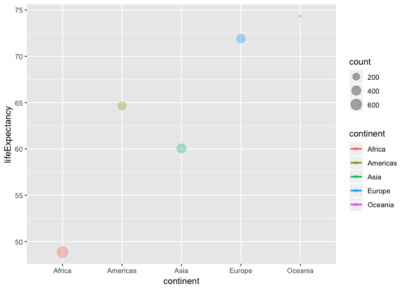
